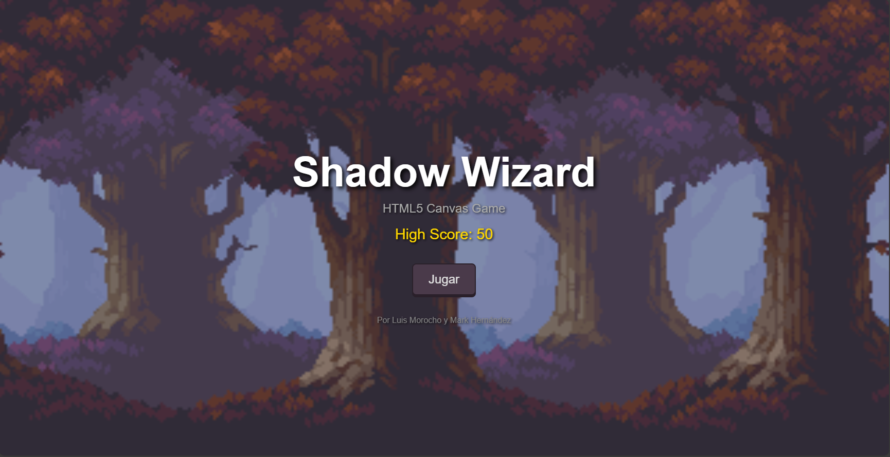
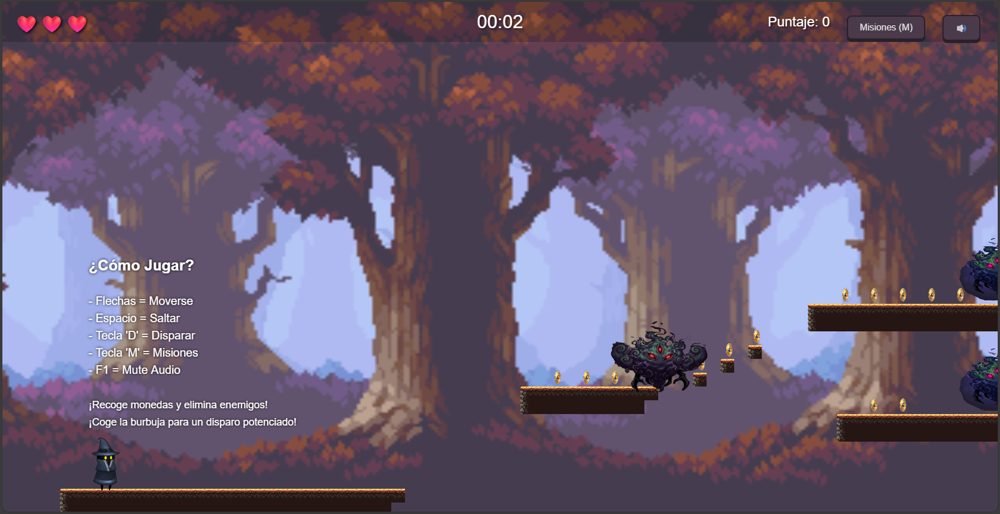
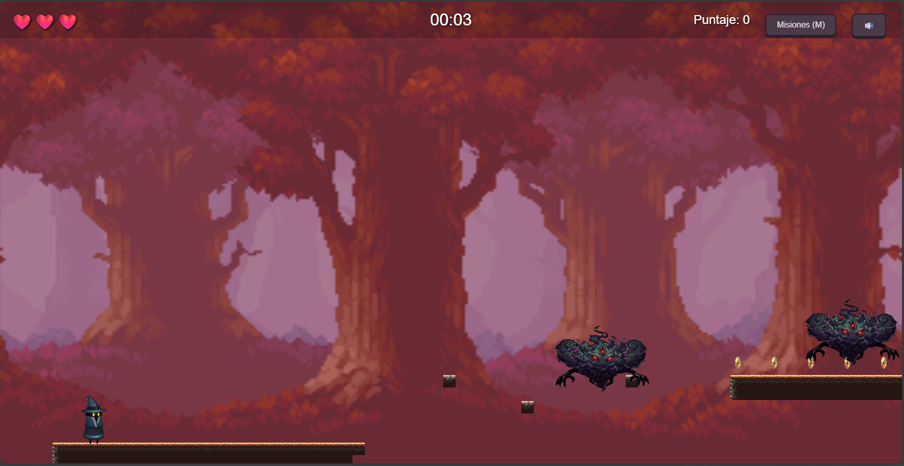
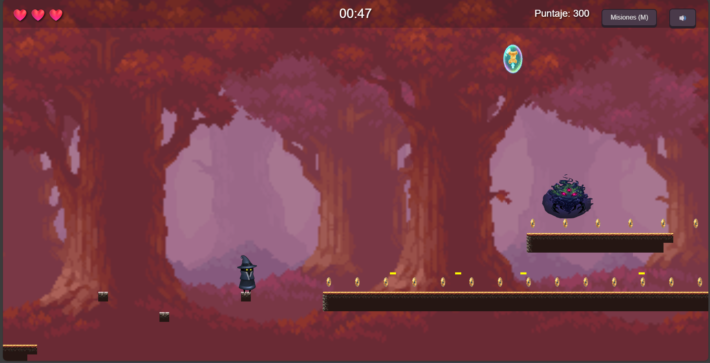
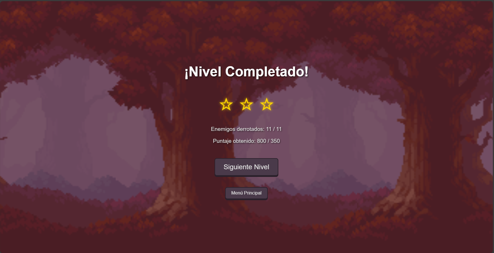

# 🎮 Shadow Wizard 🧙‍♂️✨

**Shadow Wizard** es un juego de plataformas 2D side-scrolling desarrollado con HTML5 Canvas y JavaScript puro, sin frameworks externos.


---

## 📋 Tabla de Contenidos

- [Descripción](#descripción)
- [Características](#características)
- [Instalación y Ejecución](#instalación-y-ejecución)
- [Controles](#controles)
- [Estructura del Proyecto](#estructura-del-proyecto)
- [Arquitectura](#arquitectura)
- [Requisitos del Proyecto](#requisitos-del-proyecto)
- [Créditos](#créditos)
- [Licencia](#licencia)

---

## 🎯 Descripción

Shadow Wizard es un arcade shooter side-scrolling donde controlas a un guerrero que debe atravesar 3 niveles llenos de enemigos, plataformas peligrosas y tesoros escondidos. Cada nivel presenta desafíos únicos con sistema de objetivos (estrellas) basado en rendimiento.

### 🌟 Misiones por Nivel
- ⭐ **1 Estrella:** Encontrar la salida (portal)
- ⭐ **2 Estrellas:** Derrotar a todos los enemigos
- ⭐ **3 Estrellas:** Conseguir el puntaje objetivo

---

## ✨ Características

### Gameplay
- ✅ **3 Niveles únicos** con diseño progresivo de dificultad
- ✅ **Sistema de combate** con proyectiles normales y mejorados
- ✅ **2 tipos de enemigos:** Patrulleros y Perseguidores
- ✅ **Power-ups** que mejoran tu disparo temporalmente
- ✅ **Físicas realistas** con gravedad y colisiones precisas
- ✅ **Sistema de vidas** con invencibilidad temporal
- ✅ **Coleccionables:** Monedas para aumentar tu puntaje

### Sistemas Técnicos
- ✅ **Game Loop** optimizado con `requestAnimationFrame`
- ✅ **State Manager** (Título, Selección de nivel, Jugando, Pausa, Game Over, Nivel Completado)
- ✅ **Sprite Sheets** con animaciones fluidas (idle, walk, jump)
- ✅ **Cámara con seguimiento suave** (smooth scrolling)
- ✅ **Background parallax** de 3 capas
- ✅ **Sistema de audio** con música y efectos de sonido
- ✅ **Persistencia** con localStorage (high scores, progreso, estadísticas)
- ✅ **Controles táctiles** para dispositivos móviles
- ✅ **Monitor de rendimiento** con contador de FPS
- ✅ **Responsive design** que se adapta a cualquier pantalla

### UI/UX
- ✅ **HUD completo** (vidas, tiempo, puntaje, misiones)
- ✅ **Panel de misiones** en tiempo real
- ✅ **Sistema de estrellas** por objetivos completados
- ✅ **Transiciones suaves** entre estados
- ✅ **Tutorial integrado** en el primer nivel
- ✅ **Opción de mute** para el audio
- ✅ **Controles documentados** en el juego

---

## 🚀 Instalación y Ejecución

### Opción 1: Local (Recomendado)

```bash
# Clonar el repositorio
git clone https://github.com/Luiss-Morocho/Game_Web_Shadow_Wizard.git
cd shadow-wizard

# Iniciar un servidor local (elige uno)
- Descargar e instalar Live Server en VS Code.
- Abrir el archivo dando click derecho y Open with Live Server. (se abre en el puerto 5500)

# Abrir en el navegador
# http://localhost:5500
```

### Opción 2: Abrir directamente

⚠️ **Nota:** Algunos navegadores bloquean la carga de recursos locales por seguridad. Se recomienda usar un servidor local.

1. Descomprimir el archivo ZIP
2. Abrir `index.html` en tu navegador

---

## 🎮 Controles

### Teclado (PC)
| Acción | Tecla |
|--------|-------|
| Mover izquierda | `←` o `A` |
| Mover derecha | `→` o `D` |
| Saltar | `Espacio` |
| Disparar | `D` o `F` |
| Pausar | `ESC` |
| Mostrar misiones | `M` |
| Monitor de FPS | `F3` |
| Mute audio | `F1` |

### Táctil (Móviles)
- **Joystick izquierdo:** Movimiento (◄ ►)
- **Botón saltar:** ↑ (derecha)
- **Botón disparar:** ⚡ (derecha)

---

## 📁 Estructura del Proyecto

```
shadow-wizard/
├── assets/                    # Recursos del juego
│   ├── audio/
│   │   ├── music/            # Música de fondo por nivel
│   │   │   ├── level1.mp3
│   │   │   ├── level2.mp3
│   │   │   └── level3.mp3
│   │   └── sfx/              # Efectos de sonido
│   │       ├── shoot.mp3
│   │       ├── jump.mp3
│   │       ├── coin.mp3
│   │       ├── damage.mp3
│   │       ├── powerup.mp3
│   │       ├── enemy-death.mp3
│   │       ├── level-complete.mp3
│   │       └── portal.mp3
│   ├── background/           # Capas de fondo
│   ├── character/            # Sprite sheets
│   ├── items/                # Coleccionables
│   └── portal/               # Portal de salida
│
├── engine/                    # Motor del juego (Core)
│   ├── SpriteSheet.js        # Manejo de sprite sheets
│   ├── Entity.js             # Clase base para entidades
│   ├── Camera.js             # Sistema de cámara
│   ├── loader.js             # Carga de recursos
│   └── stateManager.js       # Gestor de estados
│
├── game/                      # Lógica del juego
│   ├── entities/             # Entidades del juego
│   │   ├── Player.js         # Jugador con físicas
│   │   ├── Enemy.js          # Enemigos (normal + chaser)
│   │   └── Items.js          # Monedas, power-ups, portal
│   ├── levels/               # Sistema de niveles
│   │   ├── Platform.js       # Tipos de plataformas
│   │   └── LevelManager.js   # Generador de niveles
│   ├── systems/              # Sistemas globales
│   │   ├── Background.js     # Parallax scrolling
│   │   ├── ProjectileSystem.js # Sistema de disparos
│   │   ├── AudioManager.js   # Gestión de audio
│   │   ├── SaveManager.js    # Persistencia con localStorage
│   │   ├── TouchControls.js  # Controles táctiles
│   │   └── PerformanceMonitor.js # Monitor de FPS
│   └── Game.js               # Clase principal del juego
│
├── index.html                 # Punto de entrada HTML
├── main.js                    # Inicialización y UI
├── style.css                  # Estilos de UI
└── README.md                  # Este archivo
```

---

## 🏗️ Arquitectura

### Patrón de Diseño
El proyecto utiliza **arquitectura basada en componentes** con separación clara de responsabilidades:

- **Engine:** Código reutilizable e independiente del juego
- **Game:** Lógica específica del juego
- **Main:** Orquestación y UI

### Flujo del Game Loop

```
main.js (gameLoop)
    ↓
Game.update()
    ├→ Player.update()
    ├→ EnemyManager.update()
    ├→ ProjectileSystem.update()
    ├→ ItemManager.update()
    ├→ Camera.update()
    └→ handleCollisions()
    ↓
Game.render()
    ├→ Background.draw()
    ├→ Platforms.draw()
    ├→ Items.draw()
    ├→ Enemies.draw()
    ├→ Player.draw()
    └→ Projectiles.draw()
```

### Sistema de Colisiones
Todas las entidades usan **hitboxes ajustadas** para precisión:
- Player: 80x120 (50% del sprite visual)
- Enemies: 120x100
- Coins: 28x28
- Power-ups: 70x50
- Portal: 120x200

---

## 📊 Requisitos del Proyecto

### ✅ Completado

| Requisito | Estado | Implementación |
|-----------|--------|----------------|
| Game Loop | ✅ | `requestAnimationFrame` en `main.js` |
| Estados | ✅ | 6 estados (Título, Select, Playing, Pause, GameOver, Complete) |
| Loader | ✅ | `loader.js` con callback |
| 3 Niveles | ✅ | `LevelManager.js` con progresión |
| Física/Colisiones | ✅ | Hitboxes ajustadas en todas las entidades |
| Audio | ✅ | `AudioManager.js` - música + 8 SFX |
| Persistencia | ✅ | `SaveManager.js` con localStorage |
| UI/HUD | ✅ | HUD completo + panel de misiones |
| Responsividad | ✅ | Canvas adaptable + controles táctiles |
| Rendimiento | ✅ | `PerformanceMonitor.js` - 60 FPS target |
| Código Modular | ✅ | Arquitectura por componentes |
| Documentación | ✅ | Comentarios JSDoc + README |
| Accesibilidad | ✅ | Mute, controles documentados, tutorial |

### 🎁 Bonus Implementado
- ✅ Monitor de FPS en tiempo real
- ✅ Controles táctiles completos
- ✅ Sistema de logros/objetivos
- ✅ Estadísticas globales persistentes

---

## 🎨 Créditos

### Desarrolladores
**Luis Morocho y Mark Hernández**  
Ingeniería en Software - EPN  
Aplicaciones Web - Primer Bimestre 2025

### Assets Visuales
- **Sprite Sheets:** [itch.io - Pixel Adventure](https://pixelfrog-assets.itch.io/)
- **Tiles:** Oak Woods Tileset
- **Background:** Parallax Forest Pack

### Audio
- **Música:** Kevin MacLeod (incompetech.com)
  - "Cipher" (Nivel 1)
  - "Dark Fog" (Nivel 2)
  - "Darkest Child" (Nivel 3)
- **SFX:** Freesound.org (varios autores)

Todas las licencias: CC BY 4.0

### Tecnologías
- HTML5 Canvas
- JavaScript (ES6+)
- CSS3

### Inspirado en
- Libro: **"Pro HTML5 Games"** de Aditya Ravi Shankar
- Mecánicas clásicas de: Contra, Mega Man, Metal Slug

---

## 📄 Licencia

Este proyecto es de uso educativo como parte del curso de Aplicaciones Web.

**Assets:** Ver créditos individuales arriba.  
**Código:** MIT License - Libre para uso educativo.

---

## 🐛 Debugging

### Activar Monitor de Rendimiento
Presiona `3` durante el juego para ver:
- FPS actual (verde: >45, amarillo: 30-45, rojo: <30)
- Min/Max/Avg FPS
- Número de entidades activas
- Uso de memoria (si está disponible)

### Console Commands
Abre la consola del navegador (`F12`) y ejecuta:

```javascript
// Ver estadísticas globales
SaveManager.getProgressSummary()

// Ver high score
SaveManager.getHighScore()

// Ver datos de un nivel
SaveManager.getLevelInfo(1)

// Resetear todo el progreso
SaveManager.resetAll()

// Exportar guardado
console.log(SaveManager.exportSave())

// Toggle FPS monitor
window.performanceMonitor.toggle()

// Activar/desactivar audio
window.audioManager.toggleMute()
```

---

## 📸 Capturas de Pantalla

### Pantalla de Título


### Nivel 1 - Bosque Misterioso


### Nivel 2 - Atmósfera Azul


### Nivel 3 - Batalla Final


### HUD y Gameplay


### Sistema de Estrellas


---

## 🎬 Video Gameplay

[Ver video en YouTube]()  
Duración: 60 segundos

---

## 📝 Autoevaluación de Rúbrica

### Funcionalidad Núcleo (25%)
- [x] Game loop funcional sin bloqueos
- [x] Estados del juego bien implementados
- [x] Mecánicas de plataformas responsivas
- [x] Sistema de vidas y daño
- [x] 3 niveles jugables

**Puntaje:** 25/25

### Mecánicas/IA/Pathfinding (15%)
- [x] 2 tipos de enemigos diferentes (Normal y Chaser)
- [x] Sistema de patrullaje
- [x] Persecución de jugador
- [x] Colisiones precisas

**Puntaje:** 15/15

### Física/Colisiones (10%)
- [x] Gravedad implementada
- [x] Detección de colisiones AABB
- [x] Hitboxes ajustadas
- [x] Colisión con plataformas

**Puntaje:** 10/10

### Rendimiento (10%)
- [x] 60 FPS estables
- [x] Sin bloqueos de carga
- [x] Optimización de renderizado
- [x] Monitor de FPS

**Puntaje:** 10/10

### UX/UI (10%)
- [x] HUD completo
- [x] Controles táctiles
- [x] Tutorial integrado
- [x] Responsive design
- [x] Accesibilidad básica

**Puntaje:** 10/10

### Audio (5%)
- [x] Música de fondo
- [x] Mínimo 2 SFX (tengo 8)
- [x] Control de mute

**Puntaje:** 5/5

### Código/Arquitectura (15%)
- [x] Modularidad
- [x] Comentarios JSDoc
- [x] Separación de responsabilidades
- [x] Código limpio y legible

**Puntaje:** 15/15

### Documentación/Presentación (10%)
- [x] README completo
- [x] Capturas de pantalla
- [x] Video gameplay
- [x] Instrucciones claras

**Puntaje:** 10/10

### BONUS (+5%)
- [x] Monitor de FPS avanzado
- [x] Controles táctiles completos
- [x] Sistema de logros

**Puntaje Bonus:** +5

---

## 🎯 **PUNTAJE TOTAL: 105/100**

---

## 🔮 Futuras Mejoras

- [ ] Multijugador local (2 players)
- [ ] Más niveles y mundos
- [ ] Jefes finales
- [ ] Minimapa
- [ ] PWA (Progressive Web App)
- [ ] Más tipos de enemigos
- [ ] Sistema de mejoras permanentes
- [ ] Modo hard/easy

---

**¡Gracias por jugar Shadow Force! 🎮**

*Si encuentras algún bug o tienes sugerencias, por favor crea un issue en el repositorio.*
